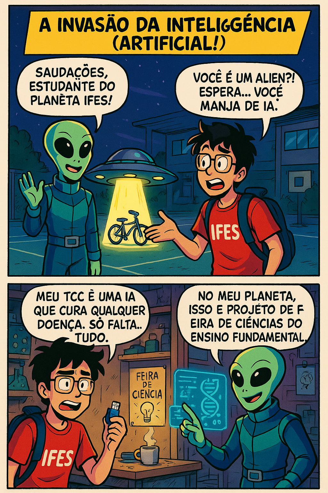
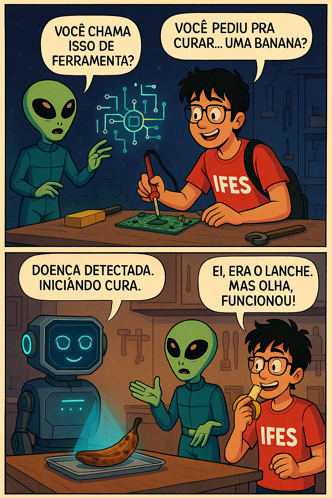
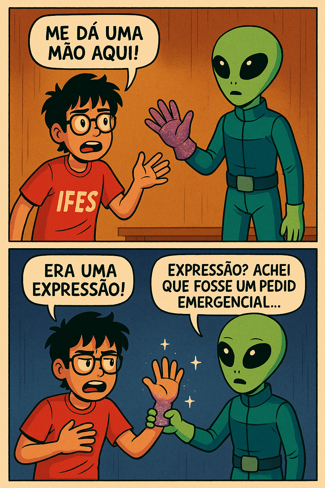

 

  <h3 align="center">A Invasão da Inteligência (Artificial)!</h3>

  <!-- ABOUT THE PROJECT -->
## Sobre o Projeto

Ficção Científica — Humor e Inovação Tecnológica.

Objetivos Principais:

* Explorar conceitos de ficção científica de forma leve e divertida.
* Promover a criatividade, o trabalho em equipe e o uso de tecnologias.
* Criar uma história envolvente que reflita o potencial da colaboração entre diferentes culturas e inteligências.
* Desenvolver uma HQ completa utilizando ferramentas acessíveis e trabalho colaborativo via GitHub e Jira.

 

### Descrição

No conto "A Invasão da Inteligência (Artificial)!", um ser extraterrestre chamado Vortex aterrissa no pátio do IFES e se depara com Léo, um aluno que batalha para concluir seu TCC sobre uma Inteligência Artificial capaz de curar qualquer enfermidade.  Surpreso com o projeto, Vortex opta por colaborar, disponibilizando sua tecnologia de ponta para agilizar o procedimento.  Mesmo com instrumentos simples e improvisados, o par inicia um trabalho conjunto, combinando a criatividade humana com o saber extraterrestre.

Nos experimentos, a Inteligência Artificial apresenta resultados surpreendentemente positivos, desde recuperar uma banana estragada até resgatar um cachorrinho enfermo da vizinhança.  Entre conflitos culturais e excelente senso de humor, a colaboração entre Léo e Vortex demonstra ser um êxito.  A narrativa termina com ambos, juntamente com o cãozinho recuperado, festejando na cantina do IFES, evidenciando que, com cooperação e inovação, mesmo as ideias mais absurdas podem prosperar e produzir deliciosas coxinhas.

 

### Estrutura Inicial da HQ

**Quadros:**
1. Chegada de Vortex ao IFES
2. Apresentação do TCC de Léo
3. Começo da parceria com tecnologia alienígena
4. Teste com banana podre
5. Problemas com expressões humanas
6. Teste com cachorro doente
7. Final feliz na cantina com coxinhas

 

### Gerenciamento

* Local onde será gerenciado o Product Backlog: https://www.atlassian.com/software/jira
* Product Backlog: https://almeidaleodev.atlassian.net/jira/software/projects/QUAD/boards/2/backlog
* Local onde será gerenciado o Sprint: https://www.atlassian.com/software/jira
* Sprint Backlog: https://almeidaleodev.atlassian.net/jira/software/projects/QUAD/boards/2
* Local onde será gerenciado o KANBAN: https://www.atlassian.com/software/jira
* O Kanban com as atividades da primeira sprint já geradas: https://almeidaleodev.atlassian.net/jira/software/projects/QK/boards/3

 

### Feito com

* GitHub
* Jira
* ChatGPT
* Word

 

<!-- USAGE -->
## Usage

Veja a história em quadrinhos: 

 

<!-- CONTRIBUTING -->
## Contribuição

### Contribuidores

<table>
  <tr>
    <td align="center">
      <a href="https://github.com/AlmeidaLeoDev" target="_blank">
         
        
          <b>Leonardo Almeida Guimarães de Souza</b>
        
      </a>
    </td>
  <tr>
</table>
    

